# Semantic TD: vat/tests

## Schema
<!-- type: schema lang: yaml -->

```yaml
semantic_domain:
  key: "vat/tests"
  source_group: "projects/vat/tests"
  coverage_kind: semantic
  evidence:
    source_units:
      - path: "projects/vat/tests/vat_emulator_storage.rs"
        language: "rust"
        ownership_state: "codegen"
        generator_primitives: ["data_model", "service_method", "test_case"]
        symbols:
          - name: "vat_bin"
            kind: "function"
            public: false
          - name: "free_port"
            kind: "function"
            public: false
          - name: "wait_for_port"
            kind: "function"
            public: false
          - name: "Killed"
            kind: "struct"
            public: false
          - name: "drop"
            kind: "function"
            public: false
          - name: "enc"
            kind: "function"
            public: false
          - name: "cloud_storage_emulator_roundtrips"
            kind: "function"
            public: false
        source_evidence_node:
          layer: "backend"
          ecosystem: "rust"
          role: "test"
          section_type: "unit-test"
          domain: "projects/vat/tests"
      - path: "projects/vat/tests/vat_emulator_auth.rs"
        language: "rust"
        ownership_state: "codegen"
        generator_primitives: ["data_model", "service_method", "test_case"]
        symbols:
          - name: "vat_bin"
            kind: "function"
            public: false
          - name: "free_port"
            kind: "function"
            public: false
          - name: "wait_for_port"
            kind: "function"
            public: false
          - name: "post"
            kind: "function"
            public: false
          - name: "Killed"
            kind: "struct"
            public: false
          - name: "drop"
            kind: "function"
            public: false
          - name: "firebase_auth_emulator_signup_signin_lookup"
            kind: "function"
            public: false
        source_evidence_node:
          layer: "backend"
          ecosystem: "rust"
          role: "test"
          section_type: "unit-test"
          domain: "projects/vat/tests"
      - path: "projects/vat/tests/vat_emulator_grpc_mitm_routing.rs"
        language: "rust"
        ownership_state: "handwrite"
        generator_primitives: ["data_model", "service_method", "test_case"]
        symbols:
          - name: "vat_bin"
            kind: "function"
            public: false
          - name: "free_port"
            kind: "function"
            public: false
          - name: "wait_for_port"
            kind: "function"
            public: false
          - name: "Killed"
            kind: "struct"
            public: false
          - name: "drop"
            kind: "function"
            public: false
          - name: "spawn_sink"
            kind: "function"
            public: false
          - name: "connect_tunnel"
            kind: "function"
            public: false
          - name: "grpc_frame"
            kind: "function"
            public: false
          - name: "grpc_routed_through_mitm_reaches_emulator"
            kind: "function"
            public: false
        source_evidence_node:
          layer: "backend"
          ecosystem: "rust"
          role: "test"
          section_type: "unit-test"
          domain: "projects/vat/tests"
      - path: "projects/vat/tests/vat_emulator_tasks_grpc.rs"
        language: "rust"
        ownership_state: "handwrite"
        generator_primitives: ["data_model", "service_method", "test_case"]
        symbols:
          - name: "vat_bin"
            kind: "function"
            public: false
          - name: "free_port"
            kind: "function"
            public: false
          - name: "wait_for_port"
            kind: "function"
            public: false
          - name: "Killed"
            kind: "struct"
            public: false
          - name: "drop"
            kind: "function"
            public: false
          - name: "spawn_sink"
            kind: "function"
            public: false
          - name: "cloud_tasks_grpc_dispatches_task_and_rest_coexists"
            kind: "function"
            public: false
        source_evidence_node:
          layer: "backend"
          ecosystem: "rust"
          role: "test"
          section_type: "unit-test"
          domain: "projects/vat/tests"
      - path: "projects/vat/tests/vat_toml_runner.rs"
        language: "rust"
        ownership_state: "codegen"
        generator_primitives: ["service_method", "test_case"]
        symbols:
          - name: "vat_bin"
            kind: "function"
            public: false
          - name: "python3_available"
            kind: "function"
            public: false
          - name: "free_port"
            kind: "function"
            public: false
          - name: "jsonl"
            kind: "function"
            public: false
          - name: "result_event"
            kind: "function"
            public: false
          - name: "vat_toml_runner_starts_service_and_returns_json_evidence"
            kind: "function"
            public: false
          - name: "failed_vat_toml_runner_keeps_logs_for_inspection"
            kind: "function"
            public: false
          - name: "ambiguous_vat_run_requires_default_runner"
            kind: "function"
            public: false
          - name: "missing_preset_binary_reports_jsonl_error"
            kind: "function"
            public: false
          - name: "auto_runtime_without_native_or_docker_reports_unavailable"
            kind: "function"
            public: false
          - name: "direct_run_mode_still_forwards_exit_code"
            kind: "function"
            public: false
          - name: "llm_guide_mentions_core_agent_contract"
            kind: "function"
            public: false
        source_evidence_node:
          layer: "backend"
          ecosystem: "rust"
          role: "test"
          section_type: "unit-test"
          domain: "projects/vat/tests"
      - path: "projects/vat/tests/behavior_vat_copy_on_write_lifecycle.rs"
        language: "rust"
        ownership_state: "codegen"
        generator_primitives: ["service_method", "test_case"]
        symbols:
          - name: "vat_copy_on_write_lifecycle"
            kind: "function"
            public: false
        source_evidence_node:
          layer: "backend"
          ecosystem: "rust"
          role: "test"
          section_type: "unit-test"
          domain: "projects/vat/tests"
      - path: "projects/vat/tests/behavior_vat_agent_state_and_diff_surface.rs"
        language: "rust"
        ownership_state: "codegen"
        generator_primitives: ["service_method", "test_case"]
        symbols:
          - name: "vat_agent_state_and_diff_surface"
            kind: "function"
            public: false
        source_evidence_node:
          layer: "backend"
          ecosystem: "rust"
          role: "test"
          section_type: "unit-test"
          domain: "projects/vat/tests"
      - path: "projects/vat/tests/vat_emulator_tasks.rs"
        language: "rust"
        ownership_state: "codegen"
        generator_primitives: ["data_model", "service_method", "test_case"]
        symbols:
          - name: "vat_bin"
            kind: "function"
            public: false
          - name: "free_port"
            kind: "function"
            public: false
          - name: "wait_for_port"
            kind: "function"
            public: false
          - name: "Killed"
            kind: "struct"
            public: false
          - name: "drop"
            kind: "function"
            public: false
          - name: "spawn_sink"
            kind: "function"
            public: false
          - name: "cloud_tasks_emulator_dispatches_task"
            kind: "function"
            public: false
        source_evidence_node:
          layer: "backend"
          ecosystem: "rust"
          role: "test"
          section_type: "unit-test"
          domain: "projects/vat/tests"
      - path: "projects/vat/tests/vat_emulator_httpmock_routing.rs"
        language: "rust"
        ownership_state: "handwrite"
        generator_primitives: ["data_model", "service_method", "test_case"]
        symbols:
          - name: "vat_bin"
            kind: "function"
            public: false
          - name: "free_port"
            kind: "function"
            public: false
          - name: "wait_for_port"
            kind: "function"
            public: false
          - name: "Killed"
            kind: "struct"
            public: false
          - name: "drop"
            kind: "function"
            public: false
          - name: "spawn_sink"
            kind: "function"
            public: false
          - name: "spawn_proxy"
            kind: "function"
            public: false
          - name: "http_mock_routes_known_host_to_local_sink"
            kind: "function"
            public: false
          - name: "http_mock_admin_registers_route_at_runtime"
            kind: "function"
            public: false
          - name: "http_mock_routes_https_via_mitm"
            kind: "function"
            public: false
        source_evidence_node:
          layer: "backend"
          ecosystem: "rust"
          role: "test"
          section_type: "unit-test"
          domain: "projects/vat/tests"
      - path: "projects/vat/tests/vat_cluster.rs"
        language: "rust"
        ownership_state: "codegen"
        generator_primitives: ["service_method", "test_case"]
        symbols:
          - name: "vat_bin"
            kind: "function"
            public: false
          - name: "jsonl"
            kind: "function"
            public: false
          - name: "result_event"
            kind: "function"
            public: false
          - name: "any_cluster_backend"
            kind: "function"
            public: false
          - name: "delete_cluster"
            kind: "function"
            public: false
          - name: "cluster_backend_unavailable_reports_jsonl_error"
            kind: "function"
            public: false
          - name: "llm_guide_mentions_cluster"
            kind: "function"
            public: false
          - name: "vat_cluster_create_exports_kubeconfig"
            kind: "function"
            public: false
          - name: "vat_cluster_standalone_lifecycle"
            kind: "function"
            public: false
        source_evidence_node:
          layer: "backend"
          ecosystem: "rust"
          role: "test"
          section_type: "unit-test"
          domain: "projects/vat/tests"
      - path: "projects/vat/tests/vat_emulator_pubsub.rs"
        language: "rust"
        ownership_state: "codegen"
        generator_primitives: ["config_surface", "data_model", "service_method", "test_case"]
        symbols:
          - name: "vat_bin"
            kind: "function"
            public: false
          - name: "free_port"
            kind: "function"
            public: false
          - name: "wait_for_port"
            kind: "function"
            public: false
          - name: "Killed"
            kind: "struct"
            public: false
          - name: "drop"
            kind: "function"
            public: false
          - name: "TOPIC"
            kind: "constant"
            public: false
          - name: "SUB"
            kind: "constant"
            public: false
          - name: "pubsub_emulator_publish_pull_ack_and_stream"
            kind: "function"
            public: false
        source_evidence_node:
          layer: "backend"
          ecosystem: "rust"
          role: "test"
          section_type: "unit-test"
          domain: "projects/vat/tests"
      - path: "projects/vat/tests/vat_emulator_scheduler_grpc.rs"
        language: "rust"
        ownership_state: "handwrite"
        generator_primitives: ["data_model", "service_method", "test_case"]
        symbols:
          - name: "vat_bin"
            kind: "function"
            public: false
          - name: "free_port"
            kind: "function"
            public: false
          - name: "wait_for_port"
            kind: "function"
            public: false
          - name: "Killed"
            kind: "struct"
            public: false
          - name: "drop"
            kind: "function"
            public: false
          - name: "spawn_sink"
            kind: "function"
            public: false
          - name: "cloud_scheduler_grpc_fires_job_on_run"
            kind: "function"
            public: false
        source_evidence_node:
          layer: "backend"
          ecosystem: "rust"
          role: "test"
          section_type: "unit-test"
          domain: "projects/vat/tests"
      - path: "projects/vat/tests/vat_cli_convention.rs"
        language: "rust"
        ownership_state: "handwrite"
        generator_primitives: ["service_method", "test_case"]
        symbols:
          - name: "vat"
            kind: "function"
            public: false
          - name: "cli_convention_help_lists_all_three"
            kind: "function"
            public: false
          - name: "cli_convention_report_issue_dry_run"
            kind: "function"
            public: false
          - name: "cli_convention_upgrade_check_exits_cleanly"
            kind: "function"
            public: false
        source_evidence_node:
          layer: "backend"
          ecosystem: "rust"
          role: "test"
          section_type: "unit-test"
          domain: "projects/vat/tests"
      - path: "projects/vat/tests/behavior_vat_resource_isolation_boundary.rs"
        language: "rust"
        ownership_state: "codegen"
        generator_primitives: ["service_method", "test_case"]
        symbols:
          - name: "vat_resource_isolation_boundary"
            kind: "function"
            public: false
        source_evidence_node:
          layer: "backend"
          ecosystem: "rust"
          role: "test"
          section_type: "unit-test"
          domain: "projects/vat/tests"
      - path: "projects/vat/tests/behavior_vat_toml_runner_local_service_smoke.rs"
        language: "rust"
        ownership_state: "codegen"
        generator_primitives: ["service_method", "test_case"]
        symbols:
          - name: "vat_toml_runner_local_service_smoke"
            kind: "function"
            public: false
        source_evidence_node:
          layer: "backend"
          ecosystem: "rust"
          role: "test"
          section_type: "unit-test"
          domain: "projects/vat/tests"
      - path: "projects/vat/tests/vat_emulator_workflows.rs"
        language: "rust"
        ownership_state: "codegen"
        generator_primitives: ["data_model", "service_method", "test_case"]
        symbols:
          - name: "vat_bin"
            kind: "function"
            public: false
          - name: "free_port"
            kind: "function"
            public: false
          - name: "wait_for_port"
            kind: "function"
            public: false
          - name: "Killed"
            kind: "struct"
            public: false
          - name: "drop"
            kind: "function"
            public: false
          - name: "spawn_sink"
            kind: "function"
            public: false
          - name: "cloud_workflows_emulator_runs_and_dispatches"
            kind: "function"
            public: false
          - name: "cloud_workflows_try_except_recovers"
            kind: "function"
            public: false
        source_evidence_node:
          layer: "backend"
          ecosystem: "rust"
          role: "test"
          section_type: "unit-test"
          domain: "projects/vat/tests"
      - path: "projects/vat/tests/vat_emulator_scheduler.rs"
        language: "rust"
        ownership_state: "codegen"
        generator_primitives: ["data_model", "service_method", "test_case"]
        symbols:
          - name: "vat_bin"
            kind: "function"
            public: false
          - name: "free_port"
            kind: "function"
            public: false
          - name: "wait_for_port"
            kind: "function"
            public: false
          - name: "Killed"
            kind: "struct"
            public: false
          - name: "drop"
            kind: "function"
            public: false
          - name: "spawn_sink"
            kind: "function"
            public: false
          - name: "cloud_scheduler_emulator_fires_job_on_run"
            kind: "function"
            public: false
        source_evidence_node:
          layer: "backend"
          ecosystem: "rust"
          role: "test"
          section_type: "unit-test"
          domain: "projects/vat/tests"
      - path: "projects/vat/tests/behavior_vat_llm_agent_usage_guide.rs"
        language: "rust"
        ownership_state: "codegen"
        generator_primitives: ["service_method", "test_case"]
        symbols:
          - name: "vat_llm_agent_usage_guide"
            kind: "function"
            public: false
        source_evidence_node:
          layer: "backend"
          ecosystem: "rust"
          role: "test"
          section_type: "unit-test"
          domain: "projects/vat/tests"
      - path: "projects/vat/tests/behavior_vat_host_process_gpu_visibility.rs"
        language: "rust"
        ownership_state: "codegen"
        generator_primitives: ["service_method", "test_case"]
        symbols:
          - name: "vat_host_process_gpu_visibility"
            kind: "function"
            public: false
        source_evidence_node:
          layer: "backend"
          ecosystem: "rust"
          role: "test"
          section_type: "unit-test"
          domain: "projects/vat/tests"
      - path: "projects/vat/tests/vat_emulator_httpmock.rs"
        language: "rust"
        ownership_state: "codegen"
        generator_primitives: ["data_model", "service_method", "test_case"]
        symbols:
          - name: "vat_bin"
            kind: "function"
            public: false
          - name: "free_port"
            kind: "function"
            public: false
          - name: "wait_for_port"
            kind: "function"
            public: false
          - name: "Killed"
            kind: "struct"
            public: false
          - name: "drop"
            kind: "function"
            public: false
          - name: "spawn_oneshot_upstream"
            kind: "function"
            public: false
          - name: "http_mock_stub_mitm_and_record_replay"
            kind: "function"
            public: false
        source_evidence_node:
          layer: "backend"
          ecosystem: "rust"
          role: "test"
          section_type: "unit-test"
          domain: "projects/vat/tests"
      - path: "projects/vat/tests/vat_emulators.rs"
        language: "rust"
        ownership_state: "codegen"
        generator_primitives: ["service_method", "test_case"]
        symbols:
          - name: "vat_bin"
            kind: "function"
            public: false
          - name: "jsonl"
            kind: "function"
            public: false
          - name: "result_event"
            kind: "function"
            public: false
          - name: "on_path"
            kind: "function"
            public: false
          - name: "gcloud_component_installed"
            kind: "function"
            public: false
          - name: "firestore_native_available"
            kind: "function"
            public: false
          - name: "gcloud_emulator_unavailable_reports_jsonl_error"
            kind: "function"
            public: false
          - name: "firebase_without_firebase_json_is_rejected"
            kind: "function"
            public: false
          - name: "firestore_emulator_exports_host"
            kind: "function"
            public: false
          - name: "firebase_bundle_exports_hosts"
            kind: "function"
            public: false
        source_evidence_node:
          layer: "backend"
          ecosystem: "rust"
          role: "test"
          section_type: "unit-test"
          domain: "projects/vat/tests"
      - path: "projects/vat/tests/vat_runner_sandbox.rs"
        language: "rust"
        ownership_state: "handwrite"
        generator_primitives: ["service_method", "test_case"]
        symbols:
          - name: "vat_bin"
            kind: "function"
            public: false
          - name: "seatbelt_active"
            kind: "function"
            public: false
          - name: "bash_available"
            kind: "function"
            public: false
          - name: "runner_mode_seatbelt_egress_allows_localhost_denies_external"
            kind: "function"
            public: false
        source_evidence_node:
          layer: "backend"
          ecosystem: "rust"
          role: "test"
          section_type: "unit-test"
          domain: "projects/vat/tests"
      - path: "projects/vat/tests/vat_emulator_openapi.rs"
        language: "rust"
        ownership_state: "codegen"
        generator_primitives: ["config_surface", "data_model", "service_method", "test_case"]
        symbols:
          - name: "vat_bin"
            kind: "function"
            public: false
          - name: "free_port"
            kind: "function"
            public: false
          - name: "wait_for_port"
            kind: "function"
            public: false
          - name: "Killed"
            kind: "struct"
            public: false
          - name: "drop"
            kind: "function"
            public: false
          - name: "SPEC"
            kind: "constant"
            public: false
          - name: "openapi_standalone_and_http_mock_source"
            kind: "function"
            public: false
        source_evidence_node:
          layer: "backend"
          ecosystem: "rust"
          role: "test"
          section_type: "unit-test"
          domain: "projects/vat/tests"
      - path: "projects/vat/tests/vat_concurrent_runners.rs"
        language: "rust"
        ownership_state: "codegen"
        generator_primitives: ["service_method", "test_case"]
        symbols:
          - name: "vat_bin"
            kind: "function"
            public: false
          - name: "jsonl"
            kind: "function"
            public: false
          - name: "result_event"
            kind: "function"
            public: false
          - name: "write_config"
            kind: "function"
            public: false
          - name: "concurrent_runners_overlap_and_report_each"
            kind: "function"
            public: false
          - name: "worst_exit_code_wins_across_concurrent_runners"
            kind: "function"
            public: false
          - name: "duplicate_runner_ids_are_rejected"
            kind: "function"
            public: false
          - name: "single_runner_keeps_legacy_log_names_and_result_shape"
            kind: "function"
            public: false
        source_evidence_node:
          layer: "backend"
          ecosystem: "rust"
          role: "test"
          section_type: "unit-test"
          domain: "projects/vat/tests"
      - path: "projects/vat/tests/vat_sandbox_egress.rs"
        language: "rust"
        ownership_state: "handwrite"
        generator_primitives: ["service_method", "test_case"]
        symbols:
          - name: "seatbelt_profile"
            kind: "function"
            public: false
          - name: "run_sandboxed"
            kind: "function"
            public: false
          - name: "localhost_only_profile_has_deny_and_localhost_allow"
            kind: "function"
            public: false
          - name: "localhost_only_profile_is_accepted_by_sandbox_exec"
            kind: "function"
            public: false
          - name: "localhost_only_allows_loopback_denies_external"
            kind: "function"
            public: false
        source_evidence_node:
          layer: "backend"
          ecosystem: "rust"
          role: "test"
          section_type: "unit-test"
          domain: "projects/vat/tests"
```

## Unit Test

```mermaid
---
id: unit-test
coverage_kind: semantic
strategy: preserve observed source behavior while semantic coverage is promoted toward generator primitives
evidence:
  source_tests:
    - path: "projects/vat/tests/vat_emulator_storage.rs"
    - path: "projects/vat/tests/vat_emulator_auth.rs"
    - path: "projects/vat/tests/vat_emulator_grpc_mitm_routing.rs"
    - path: "projects/vat/tests/vat_emulator_tasks_grpc.rs"
    - path: "projects/vat/tests/vat_toml_runner.rs"
    - path: "projects/vat/tests/behavior_vat_copy_on_write_lifecycle.rs"
    - path: "projects/vat/tests/behavior_vat_agent_state_and_diff_surface.rs"
    - path: "projects/vat/tests/vat_emulator_tasks.rs"
    - path: "projects/vat/tests/vat_emulator_httpmock_routing.rs"
    - path: "projects/vat/tests/vat_cluster.rs"
    - path: "projects/vat/tests/vat_emulator_pubsub.rs"
    - path: "projects/vat/tests/vat_emulator_scheduler_grpc.rs"
    - path: "projects/vat/tests/vat_cli_convention.rs"
    - path: "projects/vat/tests/behavior_vat_resource_isolation_boundary.rs"
    - path: "projects/vat/tests/behavior_vat_toml_runner_local_service_smoke.rs"
    - path: "projects/vat/tests/vat_emulator_workflows.rs"
    - path: "projects/vat/tests/vat_emulator_scheduler.rs"
    - path: "projects/vat/tests/behavior_vat_llm_agent_usage_guide.rs"
    - path: "projects/vat/tests/behavior_vat_host_process_gpu_visibility.rs"
    - path: "projects/vat/tests/vat_emulator_httpmock.rs"
    - path: "projects/vat/tests/vat_emulators.rs"
    - path: "projects/vat/tests/vat_runner_sandbox.rs"
    - path: "projects/vat/tests/vat_emulator_openapi.rs"
    - path: "projects/vat/tests/vat_concurrent_runners.rs"
    - path: "projects/vat/tests/vat_sandbox_egress.rs"
---
requirementDiagram

element UT_SOURCE_TESTS {
  type: "TestEvidence"
}
```

<!-- type: unit-test lang: mermaid -->



## Changes
<!-- type: changes lang: yaml -->

```yaml
coverage_kind: semantic
changes:
  - action: annotate
    section: unit-test
    description: |
      Existing test behavior is covered by the Unit Test evidence section.
    impl_mode: hand-written
  - path: "projects/vat/tests/vat_emulator_storage.rs"
    action: modify
    section: schema
    description: |
      Existing source behavior is covered by this feature/domain semantic TD.
    impl_mode: hand-written
  - path: "projects/vat/tests/vat_emulator_auth.rs"
    action: modify
    section: schema
    description: |
      Existing source behavior is covered by this feature/domain semantic TD.
    impl_mode: hand-written
  - path: "projects/vat/tests/vat_emulator_grpc_mitm_routing.rs"
    action: modify
    section: schema
    description: |
      Existing source behavior is covered by this feature/domain semantic TD.
    impl_mode: hand-written
  - path: "projects/vat/tests/vat_emulator_tasks_grpc.rs"
    action: modify
    section: schema
    description: |
      Existing source behavior is covered by this feature/domain semantic TD.
    impl_mode: hand-written
  - path: "projects/vat/tests/vat_toml_runner.rs"
    action: modify
    section: schema
    description: |
      Existing source behavior is covered by this feature/domain semantic TD.
    impl_mode: hand-written
  - path: "projects/vat/tests/behavior_vat_copy_on_write_lifecycle.rs"
    action: modify
    section: schema
    description: |
      Existing source behavior is covered by this feature/domain semantic TD.
    impl_mode: hand-written
  - path: "projects/vat/tests/behavior_vat_agent_state_and_diff_surface.rs"
    action: modify
    section: schema
    description: |
      Existing source behavior is covered by this feature/domain semantic TD.
    impl_mode: hand-written
  - path: "projects/vat/tests/vat_emulator_tasks.rs"
    action: modify
    section: schema
    description: |
      Existing source behavior is covered by this feature/domain semantic TD.
    impl_mode: hand-written
  - path: "projects/vat/tests/vat_emulator_httpmock_routing.rs"
    action: modify
    section: schema
    description: |
      Existing source behavior is covered by this feature/domain semantic TD.
    impl_mode: hand-written
  - path: "projects/vat/tests/vat_cluster.rs"
    action: modify
    section: schema
    description: |
      Existing source behavior is covered by this feature/domain semantic TD.
    impl_mode: hand-written
  - path: "projects/vat/tests/vat_emulator_pubsub.rs"
    action: modify
    section: schema
    description: |
      Existing source behavior is covered by this feature/domain semantic TD.
    impl_mode: hand-written
  - path: "projects/vat/tests/vat_emulator_scheduler_grpc.rs"
    action: modify
    section: schema
    description: |
      Existing source behavior is covered by this feature/domain semantic TD.
    impl_mode: hand-written
  - path: "projects/vat/tests/vat_cli_convention.rs"
    action: modify
    section: schema
    description: |
      Existing source behavior is covered by this feature/domain semantic TD.
    impl_mode: hand-written
  - path: "projects/vat/tests/behavior_vat_resource_isolation_boundary.rs"
    action: modify
    section: schema
    description: |
      Existing source behavior is covered by this feature/domain semantic TD.
    impl_mode: hand-written
  - path: "projects/vat/tests/behavior_vat_toml_runner_local_service_smoke.rs"
    action: modify
    section: schema
    description: |
      Existing source behavior is covered by this feature/domain semantic TD.
    impl_mode: hand-written
  - path: "projects/vat/tests/vat_emulator_workflows.rs"
    action: modify
    section: schema
    description: |
      Existing source behavior is covered by this feature/domain semantic TD.
    impl_mode: hand-written
  - path: "projects/vat/tests/vat_emulator_scheduler.rs"
    action: modify
    section: schema
    description: |
      Existing source behavior is covered by this feature/domain semantic TD.
    impl_mode: hand-written
  - path: "projects/vat/tests/behavior_vat_llm_agent_usage_guide.rs"
    action: modify
    section: schema
    description: |
      Existing source behavior is covered by this feature/domain semantic TD.
    impl_mode: hand-written
  - path: "projects/vat/tests/behavior_vat_host_process_gpu_visibility.rs"
    action: modify
    section: schema
    description: |
      Existing source behavior is covered by this feature/domain semantic TD.
    impl_mode: hand-written
  - path: "projects/vat/tests/vat_emulator_httpmock.rs"
    action: modify
    section: schema
    description: |
      Existing source behavior is covered by this feature/domain semantic TD.
    impl_mode: hand-written
  - path: "projects/vat/tests/vat_emulators.rs"
    action: modify
    section: schema
    description: |
      Existing source behavior is covered by this feature/domain semantic TD.
    impl_mode: hand-written
  - path: "projects/vat/tests/vat_runner_sandbox.rs"
    action: modify
    section: schema
    description: |
      Existing source behavior is covered by this feature/domain semantic TD.
    impl_mode: hand-written
  - path: "projects/vat/tests/vat_emulator_openapi.rs"
    action: modify
    section: schema
    description: |
      Existing source behavior is covered by this feature/domain semantic TD.
    impl_mode: hand-written
  - path: "projects/vat/tests/vat_concurrent_runners.rs"
    action: modify
    section: schema
    description: |
      Existing source behavior is covered by this feature/domain semantic TD.
    impl_mode: hand-written
  - path: "projects/vat/tests/vat_sandbox_egress.rs"
    action: modify
    section: schema
    description: |
      Existing source behavior is covered by this feature/domain semantic TD.
    impl_mode: hand-written
```
